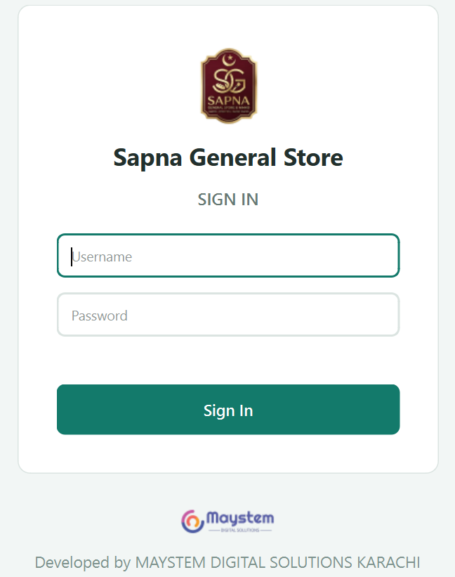
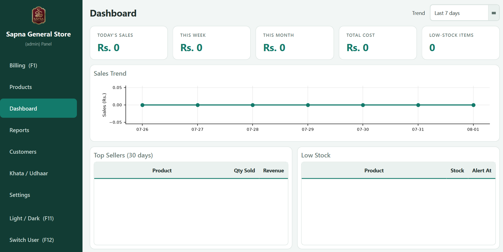
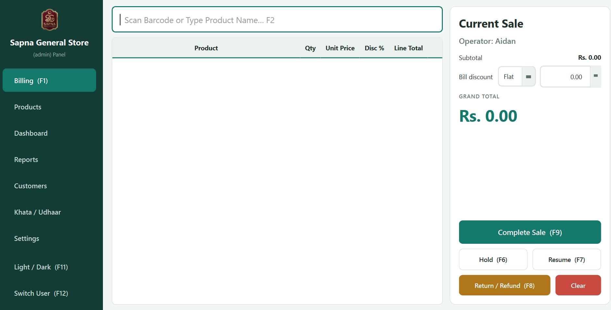
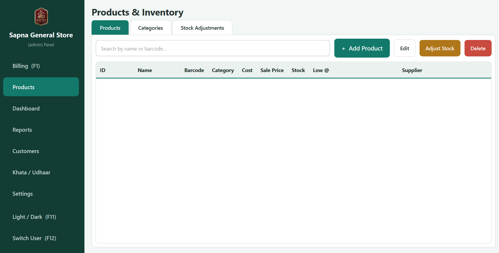
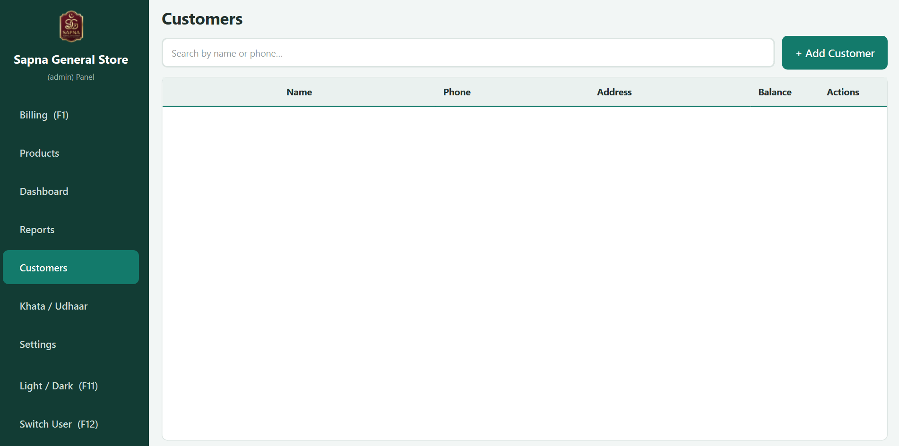
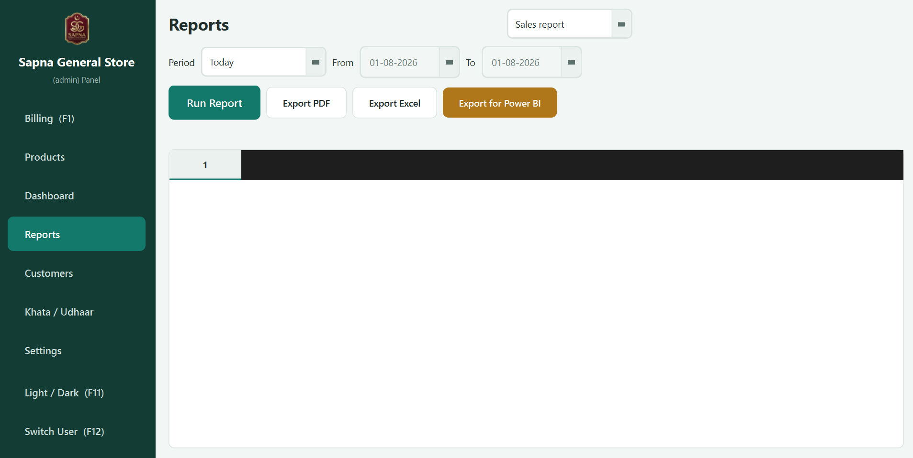
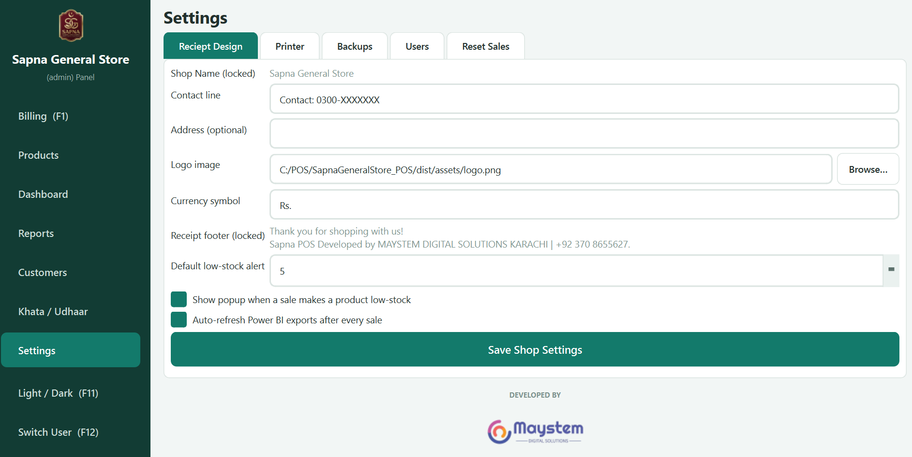
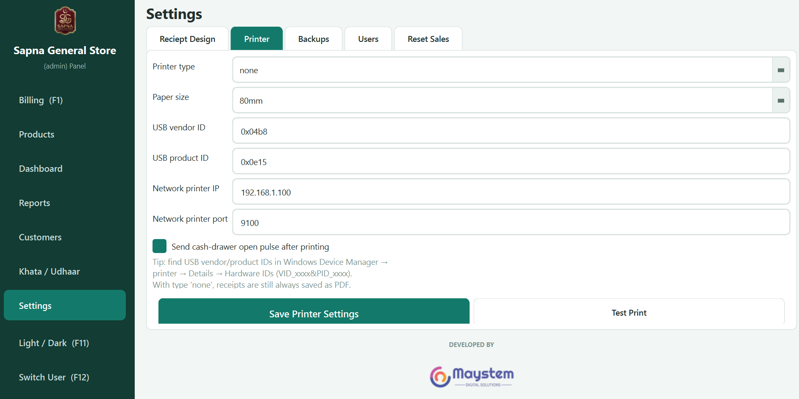
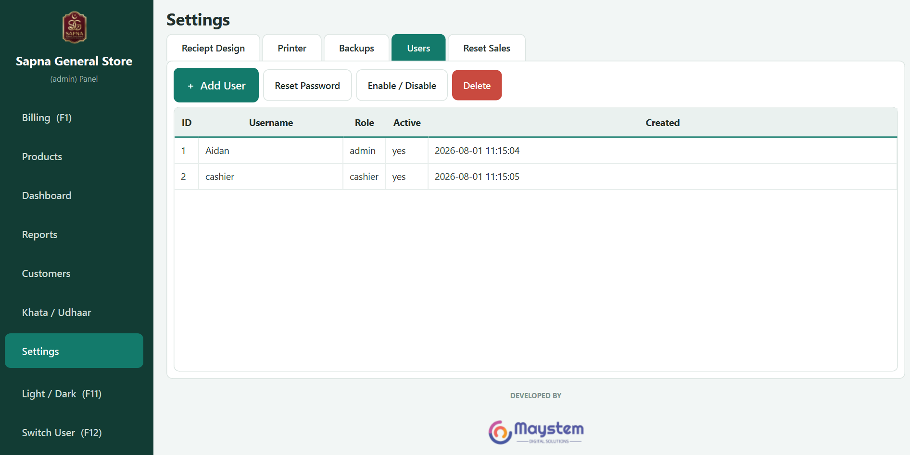
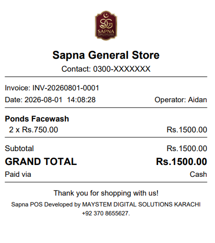

# Sapna General Store - Offline POS System

A modern offline Point of Sale (POS) desktop application built using Python, PyQt6, and SQLite.

This repository is intended for portfolio demonstration and product showcase purposes. The complete source code is maintained privately.

## Features

- Offline First Architecture
- Fast Billing System
- Product & Inventory Management
- Customer Management
- Khata Management
- Sales Reports
- PDF Receipt Generation
- Thermal Printer Support
- User & Role Management
- Dashboard Analytics
- Automatic Database Backup
- Power BI Export
- Modern PyQt6 Interface

## Technology Stack

- Python
- PyQt6
- SQLite
- Qt Designer
- PyInstaller

## Screenshots

### Login

### Dashboard

### Billing

### Products

### Customers

### Reports

### Settings

### Printer

### Users

### Receipts

## Download

The Windows executable is available from the Releases section.

## Developed By

<b>MAYSTEM DIGITAL SOLUTIONS</b> 
Karachi, Pakistan

---

This repository is published for demonstration and portfolio purposes only.